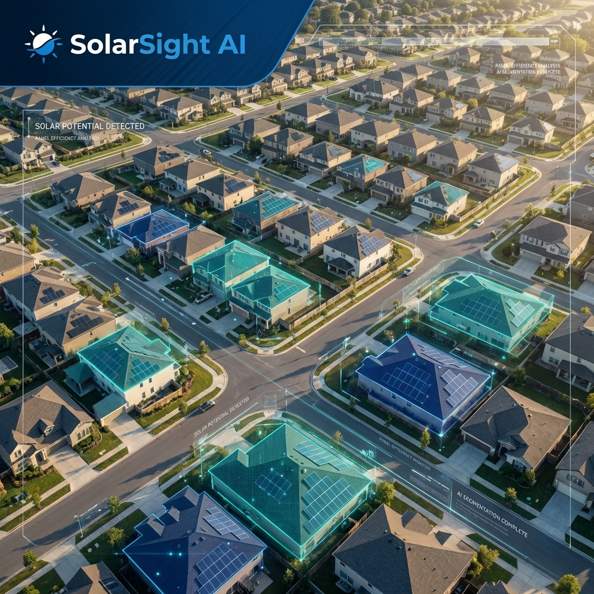
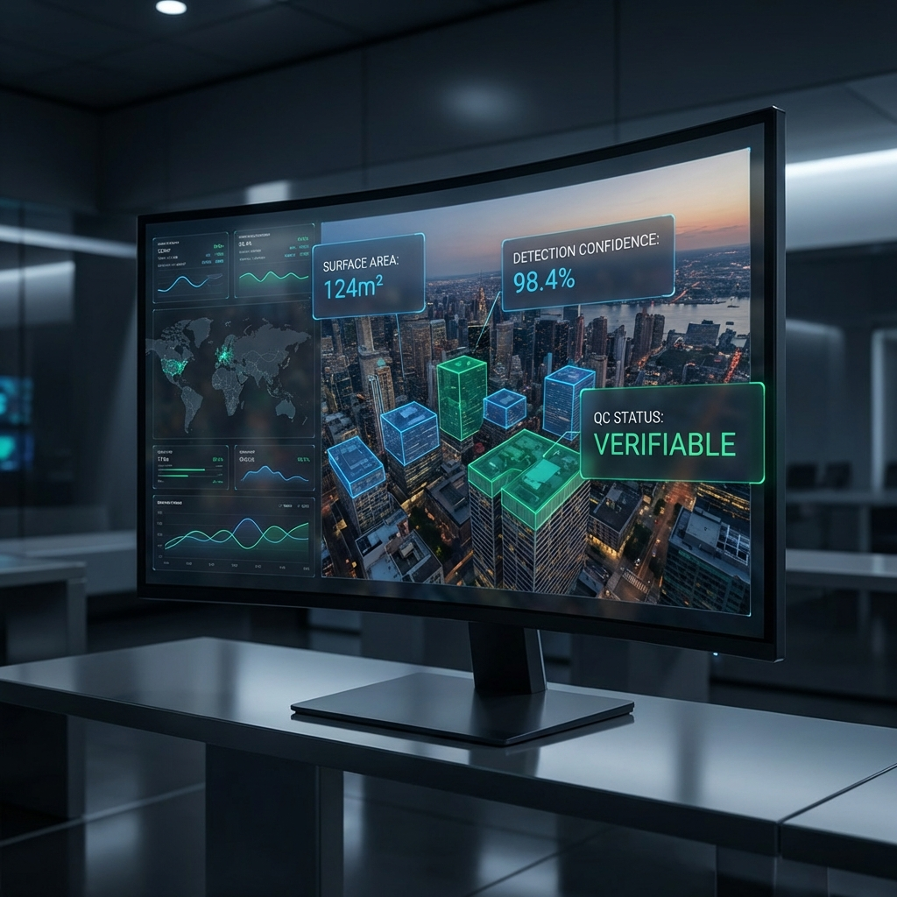

# SolarSight AI: Intelligent Rooftop Solar Verification



## Strategic Overview
SolarSight AI is an enterprise-grade automated verification system engineered to facilitate the validation of rooftop solar photovoltaic (PV) installations. Developed at the intersection of geospatial intelligence and deep learning, this platform provides a robust framework for monitoring the PM Surya Ghar: Muft Bijli Yojana initiative with unprecedented precision and scale.

---

## System Capabilities

### Geospatial Intelligence
Integration with high-fidelity satellite instrumentation allows for the automated acquisition of localized environmental imagery based on precise coordinate metadata.

### Advanced Computational Vision


The core architecture utilizes a dual-stage analytical process:
*   **Object Localization**: Leveraging YOLOv8 for rapid identification and bounding of solar arrays.
*   **Geometric Segmentation**: Pixel-level mask generation for accurate surface area quantification and spatial orientation analysis.

### Compliance and Quality Control
Each verification instance undergoes rigorous automated auditing to ensure data integrity:
*   **High-Resolution Overlays**: Semi-transparent diagnostic masks for manual audit verification.
*   **Structured Schema**: JSON-compliant data exports encompassing precise area metrics and confidence intervals.
*   **Automated Validation**: Rule-based QC engine determining verification status based on image signal-to-noise ratio and detection certainty.

---

## Technical Infrastructure

| Layer | Specification |
|:--- |:--- |
| **Analytical Engine** | Ultralytics YOLOv8 (Detect & Segment) |
| **Runtime Environment** | Python 3.10 |
| **Interface Layer** | Streamlit Web Framework |
| **Imagery Provider** | Google Cloud Geospatial APIs |
| **Deep Learning Library** | PyTorch |

---

## Directory Architecture

```text
SolarSightAI/
├── app.py                # Enterprise Web Dashboard
├── pipeline/             # Core Logic Framework
│   ├── fetch.py          # Geospatial Imagery Ingestion
│   ├── detect.py         # Neural Network Inference
│   ├── pipeline.py       # Orchestration Controller
├── trained_model/        # Model Weights & PDF Documentation
├── assets/               # Branding and Visual Assets
├── output/               # Structured Audit Artifacts
└── requirements.txt      # Environment Configuration
```

---

## Implementation Guide

### Environmental Setup
Verify that the system environment complies with the specifications detailed in `requirements.txt`.

### Launch Protocol
The centralized administration dashboard is initiated via:
```bash
streamlit run app.py
```

---

## Future Roadmap
Current engineering efforts are focused on the integration of Large Language Models (LLM) to deliver:
*   **Automated Narrative Audits**: Generating comprehensive natural-language reports for infrastructure assessment.
*   **Diagnostic Reasoning**: Providing contextual explanations for quality control exceptions (e.g., "Obstruction detected: Urban foliage density exceeds 35%").
*   **Geospatial VQA**: Implementing Visual Question Answering for complex regulatory compliance checks.

---

## Project Governance
**Team Name**: Health Coder  
**Program**: EcoInnovators 2026 – Rooftop Solar Verification  
**Principal Developers**: Akash M, Mohan Kumar  
**Technical Correspondence**: 240769.it@rmkec.ac.in

---

## Intellectual Property
This project is proprietary to Team Health Coder for the EcoInnovators 2026 initiative. The methodology and implementation are designed for research and government-scale urban planning applications.
